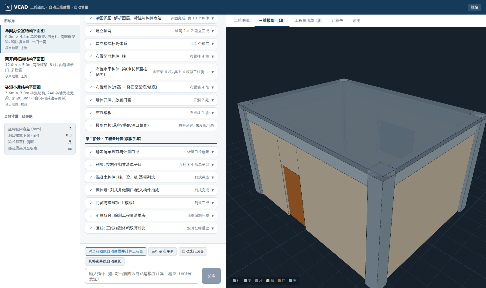

# VCAD — 二维图纸自动三维建模与自动算量

上传/选择二维施工图, 系统模拟人工建模过程自动建立三维模型, 再模拟手算过程逐项列式计算工程量, 输出符合 GB50500 清单体系的工程量清单, 并内置"准确率 + 稳定性"评价体系与自动测试迭代循环。



## 五大目标与实现对照

| 目标 | 实现 |
|---|---|
| 1. 类 Claude Code 网页版三列交互 | 左列: 图纸库与计量口径参数; 中列: 会话流(每个建模/算量步骤是可展开的步骤卡片, SSE 实时流式); 右列: 工作区(二维图纸 / 三维模型 / 工程量清单 / 计算书 / 评测 五个页签) |
| 2. 拆解建模步骤, 模拟人工建模 | 建模流水线: 读图识图 → 建立轴网 → 楼层标高 → 布置柱(含钢柱/加固柱) → 布置梁(净长算至柱侧面, 含 H 型钢梁) → 布置墙(净高至梁底) → 开洞放门窗 → 布置板 → 给排水管线 → 暖通风管 → 电气桥架末端 → 模型自检(悬空/重叠/洞口越界/假设项) |
| 3. 拆解算量步骤, 模拟手算 | 算量流水线: 确定规范与计量口径 → 列项 → 混凝土构件逐项列式 → 砌体墙扣减/钢结构吨位/加固补充子目 → 门窗与措施项目 → 安装工程(给排水/暖通/电气) → 汇总取舍编清单 → 双算复核; 每个子目生成完整计算书(规则引用/公式/代入/扣减/汇总) |
| 4. 输出符合图纸表达体系与清单规范 | 识图遵循施工图表达习惯(KZ1 400x400、KL1 250x500、M1021/C1815 门窗编号、h=120 板厚标注、澳标型钢 250UB37、加固编号 JKZ1); 输出按 GB50500-2013(房建 GB50854 / 安装 GB50856)十二位清单编码、项目特征、计量单位与有效位数规则, 每条带专业标签(结构/建筑/给排水/暖通/电气), 支持导出 CSV 清单 |
| 5. 准确率稳定性评价体系 + 自动迭代生长 | 以人工手算基准(GT)逐条比对: 准确率(偏差≤0.5%)/召回率(漏项)/精确率(多项)/稳定性(实体乱序+坐标抖动扰动重跑 5 轮须一致); 迭代循环对计量口径参数做爬山寻优(含二阶变异跳出局部最优), 从朴素基线 81.2 分自动生长收敛至 100 分 |

## 上传真实图纸

左列「上传 DWG / DXF / PDF / JSON」支持四类输入:

- **DWG / DXF**: 通过 WASM 版 LibreDWG(`backend/tools/dwg2json.mjs`, 需 Node 20+)
  从模型空间递归炸开块引用提取实体流, 再由钢结构识别器
  (`app/core/steel_recognizer.py`)完成识图:
  钢材型号表重建(编号→型号→截面→米重) → 平面定位 → 轴网 →
  柱标注吸附轴网交点 → 梁多段线就近赋名 → 板顶标高分区。
  已用真实钢结构改造图纸(AutoCAD 2018 DWG, 23 根钢柱 / 72 段钢梁 / 14 个截面规格)
  端到端验证: 识别 → H 型钢三维建模 → 按 GB50500 金属结构工程输出吨位清单
  (010603001 实腹钢柱 / 010604001 钢梁), 双算复核(截面理论质量 vs 型号名义米重)偏差 <2%。
- **PDF**: 矢量 PDF 经 `app/core/pdf_import.py` 提取(矢量线段 + 原生文本);
  CAD 用 SHX 字体出图时文字会被矢量化, 系统自动用**高倍分块 OCR**(RapidOCR,
  模型随 pip 包离线内置)恢复文字, 并用"轴距↔尺寸标注"自动标定出图比例。
  已用真实柱加固施工图(4 页 A1, 文字全部矢量化)完成测试循环:
  60 根加固柱(JKZ1~7)、两张加固表(增大截面/外包钢)全部识别,
  输出 01B 补充清单子目(增大截面混凝土 m³ / 外包角钢 t),
  加固高度等图面缺失量按显式假设计入并标记待人工复核。
- **JSON**: VCAD 实体流格式(见 `backend/app/data/samples/`), 混凝土/砌体图纸直接可用。

识别器按序尝试(钢结构平面 → 柱加固平面), 全部失败时返回结构化诊断。

识别器的每一步判断(型号表解析、标注继承、无支承梁段)都会写入识别日志,
并在模型自检与双算复核中暴露待人工复核项 —— 识别缺陷会被评价体系当场抓住
(开发中型号表串行的缺陷正是由双算复核发现并修复的, 已固化为回归测试)。

## 快速开始

```bash
# 后端 (Python 3.11+)
cd backend
pip install -r requirements.txt
uvicorn app.main:app --port 8000

# 前端 (Node 20+, pnpm)
cd frontend
pnpm install
pnpm build        # 构建后由后端 8000 端口直接托管
# 或开发模式: pnpm dev  (5173 端口, /api 代理到 8000)
```

打开 `http://localhost:8000`, 选择图纸, 点击「对当前图纸自动建模并计算工程量」。

## 命令行

```bash
cd backend
python -m pytest tests/            # 全链路单元测试(含与手算基准核对)
python -m app.eval.benchmark       # 运行基准评测
python -m app.eval.loop            # 自动迭代调参
python -m app.eval.loop --from-scratch   # 从朴素基线演示自动生长
```

## 目录结构

```
backend/
  tools/
    dwg2json.mjs      # DWG/DXF -> 实体流 JSON (WASM LibreDWG, 递归炸开块引用)
  app/
    core/
      drawing.py      # 二维图纸数据模型 + 识图(图层/标注解析, 坐标吸附)
      steel_recognizer.py # 真实钢结构图纸识别(型号表/轴网/柱梁标注/标高分区)
      reinforcement_recognizer.py # 柱加固图识别(增大截面/外包钢, 语义表格归属)
      pdf_import.py   # PDF 提取(矢量+原生文本+分块OCR+比例标定)
      geometry.py     # 三维实体建模(净长裁剪/洞口切分/H型钢/加固柱/管线放样)
      qto.py          # GB50500/GB50856 清单规则库 + 手算列式 + 双算复核
    pipeline/
      orchestrator.py # 建模/算量步骤链编排, SSE 事件协议
    eval/
      benchmark.py    # 准确率/召回/精确率/稳定性评测
      loop.py         # 自动测试-迭代循环(爬山 + 二阶变异)
      cases/*.gt.json # 人工手算基准答案
    data/samples/     # 样例图纸(模拟 DWG 解析后的分层实体流)
    main.py           # FastAPI 服务
  tests/
frontend/
  src/
    App.tsx                    # 三列布局与状态编排
    components/
      Sidebar.tsx              # 左列: 图纸库/参数
      ChatPanel.tsx            # 中列: 会话与步骤卡片流
      Workspace.tsx            # 右列: 五页签工作区
      Drawing2D.tsx            # SVG 施工图渲染
      Viewer3D.tsx             # three.js 三维模型
      BoqTable.tsx CalcSheet.tsx EvalPanel.tsx
docs/ARCHITECTURE.md  # 架构与扩展设计
```

## 设计说明

- **算量基于三维模型**: 净长/净高/扣减关系在建模阶段确定并记录于构件参数, 算量阶段直接引用, 保证"模型即证据"。
- **计算书可复核**: 每条清单量都能追溯到 规则引用 → 公式 → 逐构件代入 → 扣减明细 → 汇总取舍, 与造价员手算书同构。
- **评测防过拟合**: 基准答案为人工独立手算(见 `eval/cases/*.gt.json` 的 note 字段), 不由系统自身生成; 稳定性用亚容差扰动模拟不同绘图人差异。
- **全专业一条链路**: 结构/建筑/给排水/暖通/电气共用同一套 实体层(SCOL/SBEAM/RCOL/PIPE/DUCT/TRAY/…) → 建模 → 列式 → 清单 → 评测 管线, 新增专业只需注册实体层与计算函数。
- **可扩展输入**: `data/samples` 的实体流格式即 DWG/PDF 识别层的目标产物, 接入新的识别器(多模态识图等)只需产出同构 JSON。

更多细节见 [docs/ARCHITECTURE.md](docs/ARCHITECTURE.md)。
